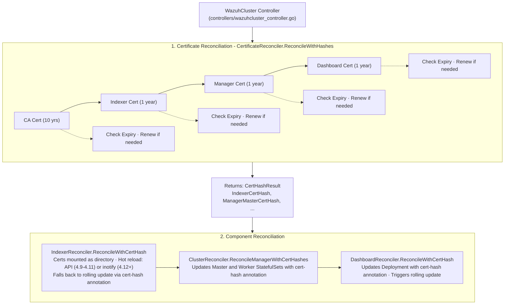

# Certificate Reconciliation Architecture

This document describes the certificate reconciliation flow in the Wazuh Operator.

## Overview

The Wazuh Operator manages TLS certificates for secure communication between cluster components:

- **CA Certificate**: Root certificate authority for the cluster
- **Indexer Certificates**: TLS certificates for OpenSearch indexer nodes
- **Manager Certificates**: TLS certificates for Wazuh manager (master and workers)
- **Dashboard Certificates**: TLS certificates for OpenSearch dashboard
- **Filebeat Certificates**: TLS certificates for Filebeat log shipping
- **Admin Certificates**: Admin certificates for OpenSearch security management

## Supported Key Algorithms

The operator supports both RSA and ECDSA key algorithms:

- **RSA** (default): 2048-bit keys, widely compatible
- **ECDSA**: Elliptic curve cryptography with P-256 or P-384 curves, smaller keys with equivalent security

## Reconciliation Flow



Default settings: 3650 days CA (10 years), 365 days node certs, 30 days renewal threshold

## Key Components

### CertificateReconciler

**Location**: `internal/certificates/reconciler/certificate_reconciler.go`

Responsible for:

- Creating and renewing the CA certificate
- Creating and renewing all node certificates
- Checking certificate expiry against configurable thresholds
- Returning certificate hashes for pod rollout triggers

Key methods:

- `ReconcileWithHashes()`: Main entry point, returns `CertHashResult`
- `reconcileCA()`: Manages CA certificate lifecycle
- `reconcileNodeCert()`: Generic node certificate creation/renewal
- `reconcileIndexerCerts()`: Indexer-specific certificate handling
- `reconcileManagerCerts()`: Manager master/worker certificate handling
- `reconcileDashboardCerts()`: Dashboard certificate handling

### RolloutWaiter

**Location**: `internal/utils/k8s_rollout.go`

Provides wait functions for pod rollouts:

- `WaitForDeploymentReady()`: Waits until Deployment is ready
- `WaitForStatefulSetReady()`: Waits until StatefulSet is ready
- `IsDeploymentReady()`: Non-blocking readiness check
- `IsStatefulSetReady()`: Non-blocking readiness check

### CertHashResult

**Location**: `internal/certificates/reconciler/certificate_reconciler.go`

Structure containing certificate hashes:

```go
type CertHashResult struct {
    CACertHash            string
    IndexerCertHash       string
    ManagerMasterCertHash string
    ManagerWorkerCertHash string
    DashboardCertHash     string
    FilebeatCertHash      string
}
```

## Certificate Hash Annotation

When certificates are renewed, the operator updates pod template annotations to trigger rollouts:

```yaml
metadata:
  annotations:
    wazuh.com/cert-hash: "sha256:abc123..."
```

The hash is computed from the certificate secret data. When this annotation changes, Kubernetes performs a rolling update of the pods.

## Configuration

### Default Configuration

- CA validity: 3650 days (10 years)
- Node certificate validity: 365 days (1 year)
- Renewal threshold: 30 days before expiry
- Key algorithm: RSA 2048-bit

### Custom Configuration via CRD

The `WazuhCluster` CRD supports custom certificate configuration:

```yaml
spec:
  tls:
    enabled: true
    certConfig:
      organization: "My Org"
      country: "US"
      caValidity: "3650d"        # Duration format: "365d", "24h", "30m"
      validity: "365d"           # Node certificate validity
      renewalThreshold: "30d"    # Renewal threshold
      caRenewalThreshold: "60d"  # CA renewal threshold
      keyAlgorithm: RSA          # or ECDSA
      ecdsaCurve: P256           # P256 or P384 (only for ECDSA)
```

## Secrets Created

| Secret Name                      | Contents           | Used By           |
| -------------------------------- | ------------------ | ----------------- |
| `{cluster}-ca`                   | CA cert, key       | All components    |
| `{cluster}-indexer-certs`        | Node cert, key, CA | Indexer pods      |
| `{cluster}-manager-master-certs` | Node cert, key, CA | Manager master    |
| `{cluster}-manager-worker-certs` | Node cert, key, CA | Manager workers   |
| `{cluster}-dashboard-certs`      | Node cert, key, CA | Dashboard         |
| `{cluster}-filebeat-certs`       | Node cert, key, CA | Filebeat sidecar  |
| `{cluster}-admin-certs`          | Admin cert, key    | Security init job |

## Events Emitted

| Event                    | Type    | Reason                   | When                       |
| ------------------------ | ------- | ------------------------ | -------------------------- |
| CertificateRenewing      | Normal  | CertificateRenewing      | Before renewal starts      |
| CertificateRenewed       | Normal  | CertificateRenewed       | After successful renewal   |
| CertificateRenewalFailed | Warning | CertificateRenewalFailed | When renewal fails         |
| CARenewing               | Normal  | CARenewing               | Before CA renewal starts   |
| CARenewed                | Normal  | CARenewed                | After CA renewal completes |

## Key Algorithm Support

### RSA (Default)

- 2048-bit key size
- Widely compatible with all systems
- Suitable for most deployments

### ECDSA

- Supports P-256 (secp256r1), P-384 (secp384r1), and P-521 (secp521r1) curves
- Security levels: P-256 (~128 bits), P-384 (~192 bits), P-521 (~256 bits)
- Smaller key sizes with equivalent security compared to RSA
- Better performance for key operations
- OpenSearch supports ECDHE_ECDSA cipher suites

## Hot Reload Mechanism

The operator supports two hot reload mechanisms depending on the Wazuh/OpenSearch version:

### API-Based Reload (Wazuh 4.9.x-4.11.x / OpenSearch 2.13-2.18)

- Enabled by setting `plugins.security.ssl_cert_reload_enabled: true` in `opensearch.yml`
- After kubelet syncs updated certificate files, the operator execs into each indexer pod and calls the OpenSearch SSL reload API endpoint
- Requires `pods/exec` RBAC permission on the operator ClusterRole (configured in `config/rbac/role.yaml`)
- Validated: zero indexer restarts during certificate renewal

### Inotify-Based Reload (Wazuh 4.12+ / OpenSearch 2.19+)

- Enabled by setting `plugins.security.ssl.certificates_hot_reload.enabled: true` in `opensearch.yml`
- OpenSearch uses inotify to detect file changes automatically
- No operator intervention needed after secret update
- Validated: zero indexer restarts during certificate renewal

### Directory Mount Requirement

Certificate files (`tls.crt`, `tls.key`, `ca.crt`) are mounted as a **directory** (without `subPath`) to enable Kubernetes automatic secret updates. When secrets are updated, kubelet automatically syncs the new files to the pod filesystem. If `subPath` were used, kubelet would not update the mounted files.

Manager, worker, and dashboard components do not support hot reload and are restarted via cert-hash annotation changes.

## Cross-Version Compatibility

### Indexer Paths

The operator uses the `/config` subdirectory for all indexer paths:

- `PathIndexerConfig = "/usr/share/wazuh-indexer/config"`
- `PathIndexerSecurityConfig = "/usr/share/wazuh-indexer/config/opensearch-security"`
- `PathIndexerCerts = "/usr/share/wazuh-indexer/config/certs"`

Certificate paths in `opensearch.yml` are **absolute** (e.g., `/usr/share/wazuh-indexer/config/certs/tls.crt`) rather than relative. This ensures compatibility across all Wazuh versions regardless of where `opensearch.path.conf` points.

### Version-Based Configuration Paths

Different Wazuh/OpenSearch versions read configuration from different base directories. The operator uses `UsesIndexerConfigDir(wazuhVersion)` with a threshold of Wazuh 4.14.0 to select a **single** mount path per version:

- Wazuh >= 4.14.0: config base is `/usr/share/wazuh-indexer/config/`
- Wazuh < 4.14.0: config base is `/usr/share/wazuh-indexer/`

This is implemented in `pkg/constants/indexer_paths.go`, with mount logic in `indexer.go` and `indexer_nodepool.go`.

## Filebeat Configuration Strategy

The operator generates a complete `filebeat.yml` via ConfigMap with all connection parameters embedded (indexer URL, credentials, SSL paths). The following Filebeat-related environment variables are intentionally **not set** on manager/worker containers:

- `INDEXER_URL`, `INDEXER_USERNAME`, `INDEXER_PASSWORD`
- `FILEBEAT_SSL_VERIFICATION_MODE`, `SSL_CERTIFICATE_AUTHORITIES`, `SSL_CERTIFICATE`, `SSL_KEY`

**Rationale:** The Wazuh container image includes an s6 init script (`1-config-filebeat`) that uses `sed` to modify `filebeat.yml` when these environment variables are present. The sed patterns expect the default image format (inline YAML arrays) and will corrupt the operator-generated YAML format (multi-line lists). By leaving these env vars unset, the init script skips modifications entirely.

An init container copies the operator-generated `filebeat.yml` from the ConfigMap to an emptyDir volume at `/etc/filebeat/`, ensuring the configuration is preserved through the container's init sequence.

This is implemented in `manager.go` and `worker.go`.

## Future Improvements

1. **Certificate Monitoring**: Dedicated certificate expiry monitoring goroutine
2. **Metrics**: Prometheus metrics for certificate status and renewal operations (implemented)
3. **ECDSA via CRD**: Expose key algorithm configuration in WazuhCluster CRD
