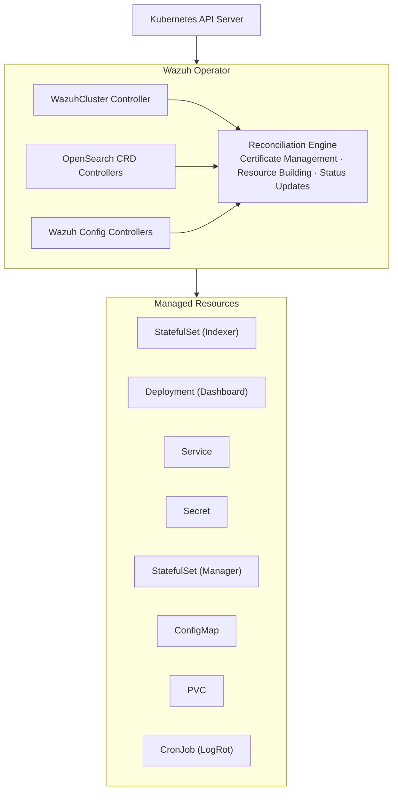

# Operator Design

This document describes the overall architecture and design decisions of the Wazuh Operator.

## Overview

The Wazuh Operator is a Kubernetes operator built with Kubebuilder v4 that manages Wazuh security platform deployments. It follows the operator pattern to provide declarative management of Wazuh clusters.

## Architecture



## Controllers

### WazuhCluster Controller

The main controller that orchestrates all components:

- **Location**: `controllers/wazuhcluster_controller.go`
- **Delegates to**: `internal/wazuh/reconciler/`, `internal/opensearch/reconciler/`, `internal/certificates/reconciler/`, `internal/networking/reconciler/`
- **Responsibilities**:
  - Reconcile certificate secrets (via `CertificateReconciler`)
  - Deploy Indexer (OpenSearch) StatefulSet (via `IndexerReconciler`)
  - Deploy Manager (master + workers) StatefulSets (via `ClusterReconciler`)
  - Deploy Dashboard Deployment (via `DashboardReconciler`)
  - Create Services, ConfigMaps, PVCs
  - Manage Gateway API routes and Ingress resources (via `GatewayReconciler`, `IngressReconciler`)
  - Manage Log Rotation CronJob
  - Manage Monitoring resources (via `MonitoringReconciler`)

### OpenSearch CRD Controllers

Controllers for managing OpenSearch security and index management:

- **Location**: `controllers/opensearch*_controller.go` → delegates to `internal/opensearch/reconciler/`
- **CRDs Managed**:
  - OpenSearchUser, OpenSearchRole, OpenSearchRoleMapping
  - OpenSearchTenant, OpenSearchActionGroup
  - OpenSearchIndexTemplate, OpenSearchComponentTemplate
  - OpenSearchISMPolicy, OpenSearchSnapshotPolicy, OpenSearchIndex

### Wazuh Config Controllers

Controllers for managing Wazuh detection rules and decoders:

- **Location**: `controllers/wazuh*_controller.go` → delegates to `internal/wazuh/reconciler/`
- **CRDs Managed**:
  - WazuhRule - Custom detection rules
  - WazuhDecoder - Custom log decoders

## Design Patterns

### Config vs Builder Separation

The codebase separates domain logic from infrastructure:

```text
internal/{wazuh,opensearch}/
├── config/                    # Domain logic: generates config file CONTENT
│   ├── ossec_conf.go          # → string (ossec.conf content)
│   ├── filebeat_config.go     # → string (filebeat.yml content)
│   └── opensearch_yml.go      # → string (opensearch.yml content)
│
└── builder/                   # Infrastructure: builds K8s resources
    ├── configmaps/            # ConfigMapBuilder.Build() → *corev1.ConfigMap
    ├── deployments/           # DeploymentBuilder.Build() → *appsv1.Deployment
    └── services/              # ServiceBuilder.Build() → *corev1.Service
```

### Resource Building

Resources are built using the builder pattern:

```go
// Example: Building a ConfigMap
ossecContent := config.DefaultOSSECConfig(name, namespace).Build()  // → string
configMap := configmaps.NewManagerConfigMapBuilder(name, namespace).
    WithOSSECConfig(ossecContent).
    Build()  // → *corev1.ConfigMap
```

### Status Management

Status updates use conditions for rich status reporting:

```go
// Set condition
conditions.SetCondition(&cluster.Status.Conditions, metav1.Condition{
    Type:    "Ready",
    Status:  metav1.ConditionTrue,
    Reason:  "AllComponentsReady",
    Message: "All cluster components are running",
})
```

## API Groups

**Primary Group**: `resources.wazuh.com/v1`

All CRDs use this single API group for consistency.

## Labels and Annotations

### Standard Labels

```yaml
app.kubernetes.io/name: wazuh-manager
app.kubernetes.io/instance: my-cluster
app.kubernetes.io/component: wazuh-manager # or wazuh-indexer, wazuh-dashboard
app.kubernetes.io/part-of: wazuh
app.kubernetes.io/managed-by: wazuh-operator
```

### Custom Annotations

```yaml
wazuh.com/cert-hash: "sha256:..." # Certificate hash for rollout triggers
wazuh.com/config-hash: "sha256:..." # ConfigMap hash for rollout triggers
```

## Error Handling

1. **Transient Errors**: Requeue with exponential backoff
2. **Permanent Errors**: Update status with error condition
3. **Conflict Errors**: Retry with fresh resource version

## Metrics

The operator exposes Prometheus metrics:

- `wazuh_cluster_reconcile_total` - Total reconciliations
- `wazuh_cluster_reconcile_errors_total` - Reconciliation errors
- `wazuh_cluster_reconcile_duration_seconds` - Reconciliation duration

## Domain Separation

The codebase enforces strict domain separation:

- `internal/wazuh/` does **NOT** import from `internal/opensearch/` and vice-versa
- Cross-cutting concerns live in shared packages:
  - `internal/certificates/`: TLS certificate management (reconciler + generation)
  - `internal/networking/`: Gateway API and Ingress reconciliation + builders
  - `internal/shared/`: Affinity, PDB, drain state machine, config, storage, patch
  - `internal/validation/`: CRD validation logic
- `pkg/` contains only stable public APIs (constants, config, dns, logging, version, versions)
- `pkg/` **NEVER** imports from `internal/`

## Future Improvements

1. **Webhooks**: Admission webhooks for validation
2. **Multi-cluster**: Federation support
3. **OLM**: OperatorHub integration
