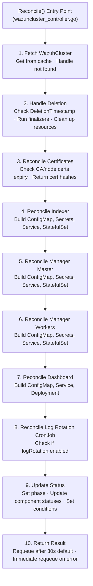
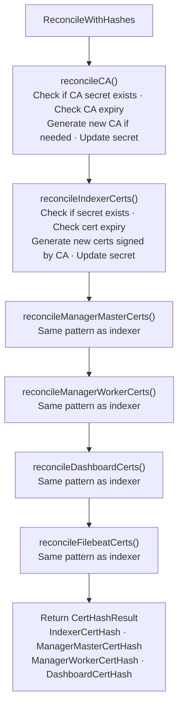

# Reconciliation Flow

This document describes how the WazuhCluster reconciliation loop works.

## Overview

The reconciliation loop is triggered when:

- A WazuhCluster resource is created, updated, or deleted
- A watched child resource (StatefulSet, Service, etc.) changes
- A requeue timer fires (default: 30 seconds)

## Main Reconciliation Flow



## Certificate Reconciliation Sub-flow



## Spec Hash Change Detection

Each component uses a **spec hash** to detect configuration changes and trigger rolling updates.
When any tracked field changes, the hash changes and the StatefulSet/Deployment pod template
annotation is updated. For StatefulSets (which use `OnDelete` update strategy), the operator's
rolling restart orchestrator then detects the revision mismatch and performs a quorum-safe
pod-by-pod restart with health checks between each deletion. For Deployments (dashboard),
Kubernetes performs a standard rolling restart.

### Tracked Fields by Component

**Manager Master** (`ManagerMasterSpecInput`):

- Version, Resources, StorageSize, Image
- NodeSelector, Tolerations, Affinity
- Env, EnvFrom
- Annotations, PodAnnotations
- ExtraConfig, ExtraVolumes, ExtraVolumeMounts
- MonitoringEnabled

**Manager Workers** (`ManagerWorkersSpecInput`):

- All of the above plus Replicas (no MonitoringEnabled)

**Indexer** (`IndexerSpecInput`):

- Version, Resources, StorageSize, JavaOpts, Image
- NodeSelector, Tolerations, Affinity
- Env, EnvFrom
- Annotations, PodAnnotations
- MonitoringEnabled

**Dashboard** (`DashboardSpecInput`):

- Version, Resources, Image
- NodeSelector, Tolerations, Affinity
- Env, EnvFrom
- Annotations, PodAnnotations

### Additional Change Detection

Beyond the spec hash, reconcilers also detect changes via:

- **Config hash**: Computed from ConfigMap data (ossec.conf, filebeat.yml, etc.)
- **Cert hash**: Computed from TLS certificate secrets
- **Annotation comparison**: Direct comparison via `utils.HashMap()` for StatefulSet and pod template annotations

## Resource Creation Pattern

Each component follows the same pattern:

```go
func (r *Reconciler) reconcileComponent(ctx context.Context, cluster *v1.WazuhCluster) error {
    // 1. Build desired state
    desired := builder.NewComponentBuilder(cluster).Build()

    // 2. Set owner reference
    if err := ctrl.SetControllerReference(cluster, desired, r.Scheme); err != nil {
        return err
    }

    // 3. Get current state
    current := &corev1.Resource{}
    err := r.Get(ctx, client.ObjectKeyFromObject(desired), current)

    if errors.IsNotFound(err) {
        // 4a. Create if not exists
        return r.Create(ctx, desired)
    } else if err != nil {
        return err
    }

    // 4b. Update if changed
    if !reflect.DeepEqual(current.Spec, desired.Spec) {
        current.Spec = desired.Spec
        return r.Update(ctx, current)
    }

    return nil
}
```

## Requeue Behavior

| Situation                  | Requeue Delay       |
| -------------------------- | ------------------- |
| Successful reconciliation  | 30 seconds          |
| Component not ready        | 10 seconds          |
| Transient error            | Exponential backoff |
| Certificate renewal needed | Immediate           |

## Watched Resources

The controller watches:

- WazuhCluster (primary)
- StatefulSets (owned)
- Deployments (owned)
- Services (owned)
- ConfigMaps (owned)
- Secrets (owned)
- CronJobs (owned)

Changes to any watched resource trigger reconciliation.

## Status Updates

Status is updated at the end of each reconciliation:

```go
cluster.Status.Phase = v1.ClusterPhaseRunning
cluster.Status.Manager = &v1.ComponentStatus{
    Phase:         "Running",
    ReadyReplicas: 3,
    Replicas:      3,
}
// ... other components

if err := r.Status().Update(ctx, cluster); err != nil {
    return ctrl.Result{}, err
}
```

## Error Handling

```go
// Transient error - requeue with backoff
if isTransient(err) {
    return ctrl.Result{RequeueAfter: 10 * time.Second}, nil
}

// Permanent error - update status and don't requeue
cluster.Status.Phase = v1.ClusterPhaseFailed
cluster.Status.Conditions = append(cluster.Status.Conditions, metav1.Condition{
    Type:    "Ready",
    Status:  metav1.ConditionFalse,
    Reason:  "ReconcileError",
    Message: err.Error(),
})
r.Status().Update(ctx, cluster)
return ctrl.Result{}, nil
```
